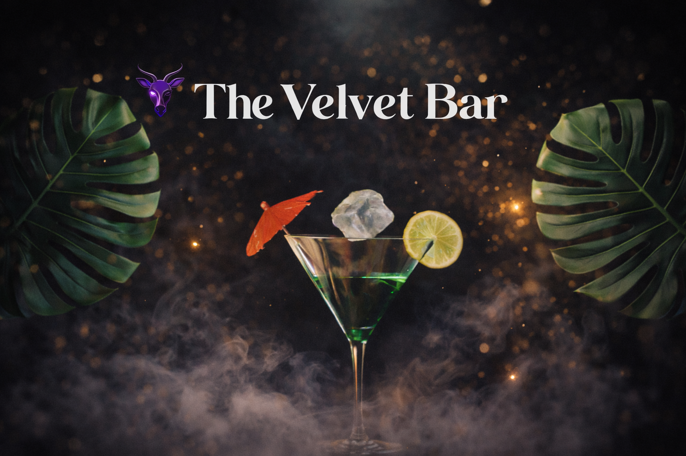
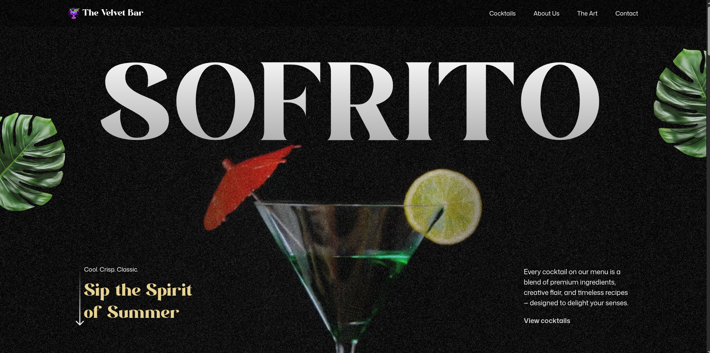

<div align="center">



<br/>


<br/>

### 🍸 A visually immersive cocktail experience built with modern frontend technologies

<br/>

<a href="https://the-velvet-bar.vercel.app/">

</a>

</div>

---

# 📖 Introduction

**The Velvet Bar** is a visually immersive cocktail showcase website designed to deliver a premium digital bar experience.

The project focuses on **advanced GSAP animations, cinematic scrolling interactions, and modern UI composition** to create an engaging and visually dynamic interface.

This project demonstrates how **animation-driven storytelling combined with modern frontend technologies** can significantly enhance user experience.

---

# ⚙️ Tech Stack

<div align="center">


</div>

---

# ✨ Features

## 🎬 Advanced GSAP Animations

👉 **SplitText Animations**
Create impactful text reveals using **GSAP SplitText** for dynamic intros and section highlights.

👉 **ScrollTrigger Effects**
Power scroll-based animations and timeline control with **GSAP ScrollTrigger**.

👉 **Seamless Timeline Animations**
Craft smooth animation timelines that orchestrate transitions across multiple sections.

---

## 🌊 Interactive Scroll Experience

👉 **Parallax Scrolling**
Add immersive depth with smooth parallax effects that respond to user scrolling.

👉 **Pinned Sections**
Lock sections in view while animating content to create engaging storytelling experiences.

👉 **Scroll-Synced Video Playback**
Synchronize video playback with scroll position for cinematic storytelling.

---

## 🎨 Visual Effects

👉 **Image Masking Effects**
Use scroll-triggered pins and masks to create visually striking image transitions.

👉 **Custom Carousel**
A fully customized carousel with animated slides and multiple navigation controls.

---

## 📱 User Experience

👉 **Responsive Design**
Ensure fluid UI layouts and adaptive GSAP animations across all screen sizes.

👉 **Modern Dark UI**
Elegant dark-themed cocktail interface with premium typography.

👉 **Performance Optimized**
Built using **Vite** for lightning-fast development and optimized builds.

---

# 🖼️ Preview



---

# 📦 Installation

Clone the repository

```bash
git clone https://github.com/Yuvrajsinghko/velvet-bar.git
```

Navigate to the project directory

```bash
cd velvet-bar
```

Install dependencies

```bash
npm install
```

Run the development server

```bash
npm run dev
```

The application will run at:

```
http://localhost:5173
```

---

# 📂 Project Structure

```
velvet-bar
│
├── public
│   └── images
│       ├── banner.png
│       └── preview.png
│
├── src
│   ├── components
│   ├── sections
│   ├── App.jsx
│   └── main.jsx
│
├── package.json
└── README.md
```

---

# 👨‍💻 Author

**Yuvraj Singh**

Frontend Developer

GitHub
https://github.com/Yuvrajsinghko

---

# ⭐ Support

If you like this project, consider giving it a ⭐ on GitHub!
